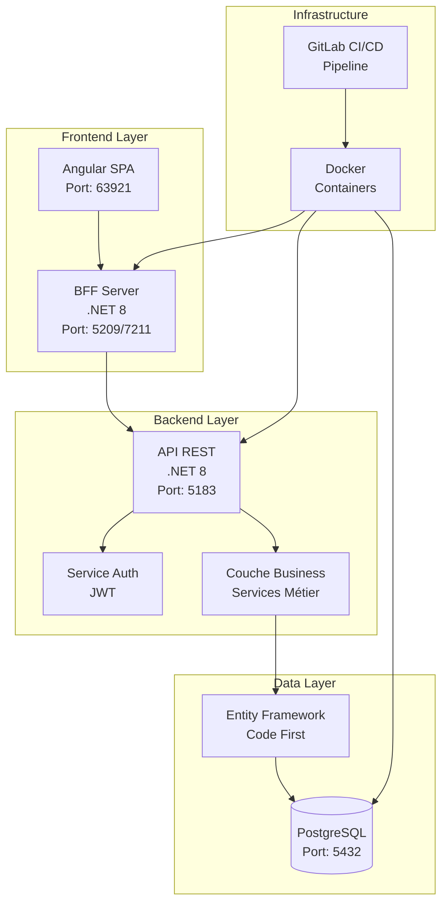
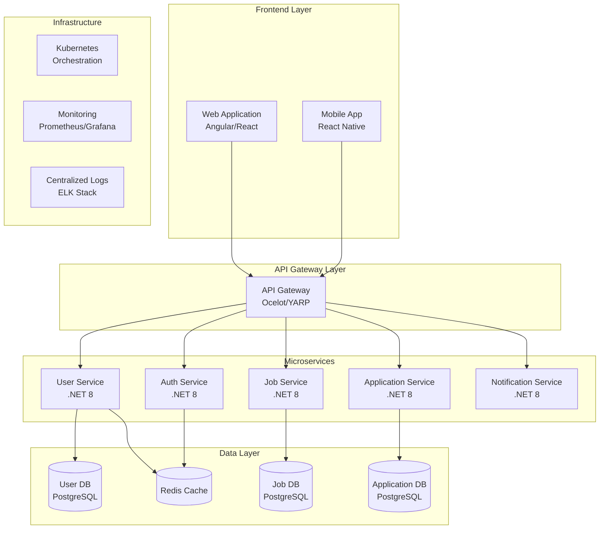

# 🎯 Site de Recrutement - Plateforme Modulaire

[](https://gitlab.com/votre-namespace/recruitment-site/-/pipelines)
[](https://gitlab.com/votre-namespace/recruitment-site/-/jobs)
[](https://opensource.org/licenses/MIT)

> Plateforme de recrutement moderne développée avec .NET 8 et Angular, conçue avec une architecture modulaire évolutive vers les microservices.

## 📋 Table des Matières

- [Vue d'ensemble](#-vue-densemble)
- [Architecture Actuelle](#-architecture-actuelle)
- [Stack Technique](#-stack-technique)
- [Installation & Démarrage](#-installation--démarrage)
- [Structure du Projet](#-structure-du-projet)
- [Fonctionnalités](#-fonctionnalités)
- [Tests & Qualité](#-tests--qualité)
- [Roadmap Microservices](#-roadmap-microservices)
- [API Documentation](#-api-documentation)
- [Contribution](#-contribution)
- [Ressources](#-ressources)

## 🚀 Vue d'ensemble

Cette plateforme de recrutement moderne offre une solution complète pour la gestion des candidatures et des processus RH. Développée avec une approche **architecture-first**, elle pose les fondations pour une évolution naturelle vers une architecture microservices modulaire.

### Objectifs Métier

- **Gestion centralisée** des utilisateurs et des rôles
- **Authentification sécurisée** avec JWT
- **Interface utilisateur moderne** et responsive
- **Architecture évolutive** vers les microservices
- **Tests automatisés** et qualité code

## 🏗️ Architecture Actuelle



### 🔧 Architecture en Couches

| Couche | Responsabilité | Technologies |
|--------|---------------|--------------|
| **Presentation** | Interface utilisateur, BFF | Angular 19, .NET 8 BFF |
| **API** | Endpoints REST, Controllers | .NET 8 Web API, JWT |
| **Business** | Logique métier, Services | .NET 8, AutoMapper |
| **Data** | Accès données, Repository | EF Core 8, PostgreSQL |
| **Shared** | Types partagés, Utilitaires | .NET 8 Standard |

## 💻 Stack Technique

### Backend
- **.NET 8** - Framework principal
- **ASP.NET Core Web API** - Services REST
- **Entity Framework Core 8** - ORM (Code First)
- **PostgreSQL** - Base de données
- **JWT Bearer** - Authentification
- **AutoMapper** - Mapping objets
- **Swagger/OpenAPI** - Documentation API

### Frontend
- **Angular 19** - Framework SPA
- **TypeScript** - Langage principal
- **RxJS** - Programmation réactive
- **Angular Router** - Navigation
- **JWT Decode** - Gestion tokens
- **Bootstrap** - Framework CSS

### Infrastructure & DevOps
- **Docker & Docker Compose** - Containerisation
- **GitLab CI/CD** - Pipeline d'intégration
- **xUnit** - Tests unitaires
- **Moq** - Framework de mocking

## 🚀 Installation & Démarrage

### Prérequis

- [.NET 8 SDK](https://dotnet.microsoft.com/download/dotnet/8.0)
- [Node.js 20+](https://nodejs.org/)
- [Docker Desktop](https://www.docker.com/products/docker-desktop)
- [PostgreSQL](https://www.postgresql.org/) (ou via Docker)

### 🐳 Démarrage avec Docker (Recommandé)

```bash
# 1. Cloner le repository
git clone https://gitlab.com/votre-namespace/recruitment-site.git
cd recruitment-site

# 2. Démarrer l'infrastructure complète
docker-compose up -d

# 3. Vérifier les services
docker-compose ps
```

**Services disponibles :**
- 🌐 **Frontend Angular** : http://localhost:63921
- 🔧 **BFF Server** : http://localhost:5209
- 🚀 **API Backend** : http://localhost:5183
- 📊 **API Documentation** : http://localhost:5183/swagger
- 🗄️ **PostgreSQL** : localhost:5432

### 🔧 Démarrage en Développement

```bash
# 1. Base de données
docker run -d --name postgres-dev \
  -e POSTGRES_USER=zahagadmin \
  -e POSTGRES_PASSWORD=24rnUZ42 \
  -e POSTGRES_DB=recrutdb \
  -p 5432:5432 postgres:latest

# 2. Backend API
cd Recrut.API
dotnet restore
dotnet ef database update
dotnet run

# 3. BFF Server (nouveau terminal)
cd Recrut.AppliWeb/Recrut.AppliWeb.Server
dotnet restore
dotnet run

# 4. Frontend Angular (nouveau terminal)
cd Recrut.AppliWeb/recrut.appliweb.client
npm install
npm start
```

## 📁 Structure du Projet

```
📦 SiteRecrutement/
├── 🏢 Recrut.API/                     # API REST principale
│   ├── Controllers/                   # Controllers API
│   ├── Configuration/                 # Configuration services
│   ├── DTOs/                         # Data Transfer Objects
│   ├── Middleware/                   # Middlewares custom
│   └── Dockerfile                    # Container API
├── 🌐 Recrut.AppliWeb/               # Frontend & BFF
│   ├── Recrut.AppliWeb.Server/       # Backend for Frontend
│   └── recrut.appliweb.client/       # Application Angular
├── 💼 Recrut.Business/               # Logique métier
│   └── Services/                     # Services business
├── 🗄️ Recrut.Data/                   # Accès aux données
│   ├── Repositories/                 # Repository pattern
│   ├── Migrations/                   # Migrations EF Core
│   └── AppDbContext.cs              # Context Entity Framework
├── 📋 Recrut.Models/                 # Entités de domaine
│   ├── User.cs                      # Entité utilisateur
│   ├── Role.cs                      # Entité rôle
│   └── Interfaces/                  # Interfaces communes
├── 🔧 Recrut.Shared/                 # Utilitaires partagés
├── 🧪 Recrut.Tests/                  # Tests unitaires
├── 🔬 Recrut.TestIntegration/        # Tests d'intégration
├── 📜 scripts/                       # Scripts utilitaires
│   ├── run-coverage.sh              # Script de couverture
│   └── sync_issues.py               # Synchronisation GitLab
├── 🐳 docker-compose.yml             # Configuration Docker
├── 🔄 .gitlab-ci.yml                 # Pipeline CI/CD
└── 📖 README.md                      # Cette documentation
```

## ⚡ Fonctionnalités

### 🔐 Authentification & Autorisation
- **JWT Authentication** avec refresh tokens
- **Gestion des rôles** (Admin, User)
- **Guards Angular** pour protection des routes
- **Middleware de sécurité** ASP.NET Core

### 👥 Gestion des Utilisateurs
- **CRUD complet** des utilisateurs
- **Hashage sécurisé** des mots de passe (PBKDF2)
- **Validation des données** côté client et serveur
- **Gestion des profils** et permissions

### 🏗️ Architecture Technique
- **Repository Pattern** pour l'accès aux données
- **Dependency Injection** native .NET
- **Exception Handling** centralisé
- **Validation** avec Data Annotations
- **Mapping automatique** avec AutoMapper

## 🧪 Tests & Qualité

### Stratégie de Tests

```bash
# Tests unitaires
dotnet test Recrut.Tests/

# Tests d'intégration
dotnet test Recrut.TestIntegration/

# Couverture de code
./scripts/run-coverage.sh
# ou
./scripts/Run-Coverage.ps1
```

### Métriques Qualité

| Type | Framework | Couverture Cible |
|------|-----------|------------------|
| **Tests Unitaires** | xUnit + Moq | > 80% |
| **Tests Intégration** | ASP.NET Core Testing | > 70% |
| **Tests Frontend** | Jasmine + Karma | > 75% |

### Structure des Tests

```
🧪 Tests/
├── Recrut.Tests/                    # Tests unitaires
│   ├── Services/                    # Tests services business
│   │   ├── AuthServiceTests.cs      # Tests authentification
│   │   └── PasswordHasherTests.cs   # Tests hashage
│   └── Repositories/                # Tests repository
├── Recrut.TestIntegration/          # Tests d'intégration
│   ├── Controllers/                 # Tests controllers API
│   └── TestUtilities/              # Helpers tests
└── .runsettings                    # Configuration tests
```

## 🚀 Roadmap Microservices

### 🎯 Vision Architecture Cible



### 📋 Plan de Migration

| Phase | Objectif | Durée Estimée | Statut |
|-------|----------|---------------|---------|
| **Phase 1** | Extraction Service Auth | 2-3 semaines | 🔄 En cours |
| **Phase 2** | Service User Management | 3-4 semaines | 📋 Planifié |
| **Phase 3** | Service Job Management | 4-5 semaines | 📋 Planifié |
| **Phase 4** | API Gateway & Load Balancing | 2-3 semaines | 📋 Planifié |
| **Phase 5** | Kubernetes & Monitoring | 3-4 semaines | 📋 Planifié |

### 🔧 Préparation Microservices

Le projet actuel est déjà structuré pour faciliter l'extraction en microservices :

- ✅ **Séparation claire** des responsabilités
- ✅ **Repository Pattern** pour l'isolation des données
- ✅ **Services découplés** dans la couche Business
- ✅ **DTOs** pour les contrats d'API
- ✅ **Configuration centralisée**
- ✅ **Tests complets** pour assurer la stabilité

## 📚 API Documentation

### Endpoints Principaux

| Endpoint | Méthode | Description | Authentification |
|----------|---------|-------------|------------------|
| `/api/auth/login` | POST | Connexion utilisateur | ❌ Public |
| `/api/users` | GET | Liste des utilisateurs | 🔒 Admin |
| `/api/users/{id}` | GET | Utilisateur par ID | 🔒 Authentifié |
| `/api/users` | POST | Créer utilisateur | 🔒 Admin |
| `/api/users/{id}` | PUT | Modifier utilisateur | 🔒 Admin |
| `/api/users/{id}` | DELETE | Supprimer utilisateur | 🔒 Admin |

### 🔧 Configuration API

```json
{
  "Jwt": {
    "Issuer": "Recrut.API",
    "Audience": "Recrut.Client",
    "ExpiryMinutes": 60
  },
  "ConnectionStrings": {
    "DefaultConnection": "Host=localhost;Port=5432;Database=recrutdb;Username=zahagadmin;Password=***"
  }
}
```

## 🤝 Contribution

### Workflow de Développement

1. **Créer une branche** feature à partir de `main`
   ```bash
   git checkout -b feature/nom-de-la-fonctionnalite
   ```

2. **Développer** avec les conventions du projet
   - Tests unitaires obligatoires
   - Documentation mise à jour
   - Respect des standards de code

3. **Tests locaux** avant push
   ```bash
   dotnet test
   npm test
   ./scripts/run-coverage.sh
   ```

4. **Merge Request** avec :
   - Description détaillée
   - Tests passants
   - Review obligatoire

### 📋 Standards de Code

- **C#** : Conventions Microsoft + StyleCop
- **TypeScript** : ESLint + Prettier
- **Commits** : [Conventional Commits](https://www.conventionalcommits.org/)
- **Branches** : `feature/`, `bugfix/`, `hotfix/`

### 🚀 Pipeline CI/CD

```yaml
stages:
  - build          # Compilation .NET + Angular
  - test           # Tests unitaires + intégration
  - quality        # SonarQube analysis
  - package        # Build images Docker
  - deploy         # Déploiement automatisé
```

## 📊 Monitoring & Observabilité

### Métriques Techniques
- **Performance API** : Temps de réponse < 200ms
- **Disponibilité** : SLA 99.9%
- **Couverture Tests** : > 80%
- **Qualité Code** : SonarQube Grade A

### Logging
- **Structured Logging** avec Serilog
- **Correlation IDs** pour traçabilité
- **Centralization** prête pour ELK Stack

## 🔗 Ressources

### Documentation Technique
- [🏗️ Architecture Decision Records](./docs/adr/)
- [📖 Guide des API](./docs/api-guide.md)
- [🧪 Guide des Tests](./docs/testing-guide.md)
- [🚀 Guide de Déploiement](./docs/deployment-guide.md)

### Outils de Développement
- [Visual Studio 2022](https://visualstudio.microsoft.com/)
- [VS Code](https://code.visualstudio.com/) avec extensions C# et Angular
- [Docker Desktop](https://www.docker.com/products/docker-desktop)
- [DBeaver](https://dbeaver.io/) pour PostgreSQL

### Références Externes
- [📚 .NET 8 Documentation](https://docs.microsoft.com/en-us/dotnet/)
- [🅰️ Angular Documentation](https://angular.io/docs)
- [🐘 PostgreSQL Documentation](https://www.postgresql.org/docs/)
- [🐳 Docker Documentation](https://docs.docker.com/)

---

## 📞 Support & Contact

- **Issues** : [GitLab Issues](https://gitlab.com/votre-namespace/recruitment-site/-/issues)
- **Discussions** : [GitLab Discussions](https://gitlab.com/votre-namespace/recruitment-site/-/issues)
- **Wiki** : [Project Wiki](https://gitlab.com/votre-namespace/recruitment-site/-/wikis/home)

---

**Développé avec ❤️ par l'équipe Recruitment Platform**

*Dernière mise à jour : Juin 2025*